# Merge Marshal MVP North Star

## Purpose

This document is the durable product and implementation reference for the independent Merge Marshal MVP.

The MVP is a local interactive proof of one idea:

> Before coding agents modify a repository, show what each task intends to change, detect when plans conflict, establish a safe execution order, and compare the final implementation with the approved plan.

The MVP is not intended to be a production multi-agent platform. It should prove that architecture-grounded visual coordination makes concurrent agent work easier to understand and safer to approve.

This implementation is intentionally independent from the parallel product implementation. The only shared technical foundation is the hierarchical graph-generation toolkit and its canonical `.graph/graph.json` artifact.

The dependency-ordered delivery plan and current implementation checkpoint are maintained in [`MVP_IMPLEMENTATION_PLAN.md`](./MVP_IMPLEMENTATION_PLAN.md).

## Product outcome

The completed MVP must let a viewer understand, in one continuous workflow:

1. What the repository contains.
2. What each task intends to change.
3. Which effects are direct, downstream, or uncertain.
4. Why two tasks conflict.
5. Why another task can execute independently.
6. How replanning resolves a conflict.
7. Whether the implementation matched the approved plan.

The demo should communicate this without requiring the viewer to inspect raw JSON, terminal output, or source code.

## North-star workflow

```text
Open the application
        ↓
Load one repository's .graph/graph.json through the backend
        ↓
Display a depth-limited hierarchical architecture graph
        ↓
Submit three implementation tasks
        ↓
Generate one structured change contract per task
        ↓
Overlay the three plans on the architecture graph
        ↓
Calculate direct, downstream, and uncertain impact
        ↓
Detect that Task A conflicts with Task B
        ↓
Show that Task A and Task C can execute together
        ↓
User approves the coordinated plan
        ↓
Task A and Task C execute while Task B waits
        ↓
Task B replans after Task A completes
        ↓
Task B executes against the revised assumption
        ↓
Compare planned effects with actual changes
        ↓
Display the final result and refreshed architecture
```

## Demo scenario

The MVP supports exactly one curated target repository and three prepared tasks.

```text
Task A: Rename UserResponse.user_id to UserResponse.actor_id.

Task B: Add response caching using the canonical identity field.

Task C: Add unrelated structured logging to payment endpoints.
```

The intended coordination result is:

```text
Task A removes or renames a resource that Task B expects to consume.
Task A therefore blocks Task B.
Task C is independent of both tasks.

Execution batch 1: Task A and Task C
Execution batch 2: Task B, after replanning against Task A's result
```

This scenario is deliberately curated. The MVP does not claim to detect every form of semantic conflict in arbitrary repositories.

## Technical shape

```text
React frontend
    ↕ REST commands/queries and server-sent run events
FastAPI backend
    ├── graph projection service
    ├── run and task state
    ├── contract validation
    ├── impact calculation
    ├── conflict detection
    ├── dependency scheduling
    ├── planner/worker adapters
    └── plan-versus-actual comparison
        ↕
Canonical .graph/graph.json + transient run data
```

### Full component diagram

The repository-level technical diagram is embedded below from [`mermaid-diagram.svg`](./mermaid-diagram.svg). It is the detailed component map for the product described by this document.



### How to interpret the diagram

The diagram is divided into five runtime boundaries:

1. **Frontend — React application:** The request composer, task/agent panel, architecture canvas, inspector, and timeline are browser views over one frontend run store. The REST client sends commands and queries to FastAPI, while the SSE subscriber receives ordered run events. The frontend owns presentation and interaction state only.
2. **Backend — FastAPI application:** The Graph API serves projections of the canonical graph. The run/task API receives requests and approval. Worker callback routes receive planner contracts and implementation results. Backend services validate contracts, calculate impact, detect conflicts, schedule tasks, dispatch work, verify results, and compare plans with actual changes.
3. **Model-powered workers:** The decomposer turns the user request into tasks. Planner workers inspect repository context and return `ChangeContract` objects. The replanning worker receives an existing contract plus conflict constraints and returns a new version. These workers propose structured results; they are not authoritative for task state or scheduling.
4. **Repository workers:** Implementation workers operate only after a plan is accepted. They produce patches and changed-file reports. The test runner and verifier decide whether results are acceptable. Graph regeneration happens only after accepted code is persisted.
5. **Authoritative state:** `.graph/graph.json` owns verified architecture, SQLite or in-memory backend state owns the coordination run, the target Git repository owns source code, and patch/test artifacts own proposed implementation results. Temporary plan overlays never become canonical architecture.

The main data flow represented by the arrows is:

```text
User request
  → Run API and run state machine
  → Orchestrator and task decomposition
  → Planner workers
  → Validated change contracts
  → Impact and conflict calculation
  → Dependency scheduler
  → Ready/blocked events shown in the frontend
  → User approval
  → Implementation workers
  → Patch, tests, and verification
  → Plan-versus-actual comparison
  → Graph regeneration
  → Updated frontend state
```

The diagram shows the full conceptual architecture, not a requirement that every box be production-real in the first MVP. Apply the scope rules in this document as follows:

| Diagram component | MVP treatment |
|---|---|
| React views, frontend store, REST client | Real |
| Graph API and graph service | Real |
| Run/task API and state transitions | Real |
| Contract validation, impact, conflicts, scheduler | Real deterministic logic |
| SSE event API | Real, or deterministic polling only if SSE becomes a time blocker |
| Task decomposer | Fixture or mocked initially |
| Planner workers | Fixtures initially; one live planner is the preferred stretch goal |
| Replanning worker | Deterministic revised fixture initially |
| Implementation workers | Simulated through prepared run events/results initially |
| Test runner and patch artifacts | Prepared results initially |
| Graph regeneration | Before/after graph fixtures initially; live regeneration is a stretch goal |
| SQLite | Optional until the in-memory workflow is reliable |

When this document and the diagram appear to differ, use this rule: the diagram explains component responsibility and data flow; the numbered requirements and explicit non-goals define what must actually be implemented for the MVP.

Suggested project ownership:

```text
frontend/               Visual product and browser state
backend/                HTTP API, run lifecycle, events, and integration
coordination-core/      Pure contracts, impact, conflict, and scheduling logic
demo/                   Target repository, tasks, contracts, and result fixtures
hierarchical-graph/     Existing shared graph toolkit
```

The frontend must not own conflict detection, impact traversal, scheduling, or canonical graph mutation. The backend must not own graph layout, zoom, selection, or other presentation-only state.

## Requirement 1: One curated demo repository

The MVP must include one prepared repository containing:

- A valid canonical `.graph/graph.json`.
- Code that supports the Task A, B, and C scenario.
- Tests that expose the stale Task B assumption when combined with Task A.
- Known expected plans and implementation results.

The demo repository is complete when it reliably produces one blocked task, two concurrently ready tasks, one replan, and a successful final result.

## Requirement 2: One-screen application

The MVP must provide one main screen containing:

- A hierarchical architecture graph.
- Three task cards or an equivalent task lane.
- A request input or demo-run control.
- A selected-node, evidence, and conflict inspector.
- A run-status timeline.

The complete story must be understandable without navigating through multiple dashboards or configuration pages.

## Requirement 3: Backend-loaded architecture graph

The frontend must load the graph from the backend rather than importing a bundled frontend fixture.

Minimum endpoint:

```http
GET /api/graph?root={optional_node_id}&depth={1_or_2}
```

The backend must:

- Read `.graph/graph.json`.
- Validate it with the hierarchical graph contract.
- Produce a depth-limited projection.
- Preserve hierarchy through `parent_id`.
- Aggregate relationships whose concrete endpoints are hidden below the displayed depth.
- Return node artifacts, symbols, edge evidence, and projection metadata.

Changing the graph available to the backend must change what the frontend renders without rebuilding the frontend.

Only `.graph/graph.json` is canonical. Reverse indexes, warnings, Mermaid, layout coordinates, and other derivable views must not be persisted.

## Requirement 4: Three-task coordination run

The user must be able to create a coordination run containing the three demo tasks.

Minimum endpoints:

```http
POST /api/runs
GET  /api/runs/{run_id}
```

Each task must have:

- Stable ID.
- Title and instructions.
- Current status.
- Display identity for overlays.
- Planning result.
- Blocking dependencies, if any.

Minimum task statuses:

```text
QUEUED
PLANNING
PLANNED
READY
BLOCKED
RUNNING
REPLANNING
VERIFYING
COMPLETED
FAILED
```

The backend is authoritative for task state. The frontend renders state received from the backend.

## Requirement 5: Structured change contracts

Every task must produce a validated `ChangeContract` before it may execute.

The contract must support varied changes without reducing every plan to a flat property patch. It uses polymorphic effects: every effect has a small common envelope for coordination, while its `details` payload is validated according to its effect kind.

Minimum conceptual shape:

```json
{
  "task_id": "task-a",
  "version": 1,
  "summary": "Rename the canonical identity field",
  "effects": [
    {
      "effect_id": "effect-a-rename-user-id",
      "kind": "symbol_change",
      "interaction": "retire",
      "resource_id": "python:symbol:src/schemas/user.py::UserResponse.user_id",
      "target": {
        "node_id": "user-schema",
        "path": "src/schemas/user.py",
        "symbol": "UserResponse.user_id"
      },
      "details": {
        "change": "rename",
        "replacement_symbol": "UserResponse.actor_id"
      },
      "intent": "Replace the old canonical identity field",
      "confidence": 0.99
    }
  ],
  "diagram_impact_claims": [
    {
      "node_id": "user-schema",
      "classification": "direct",
      "reason": "The declared symbol is owned by this component"
    }
  ],
  "tests_required": [
    "User responses expose actor_id"
  ]
}
```

Minimum effect kinds:

```text
artifact_change
symbol_change
behavior_change
test_change
architecture_node_change
architecture_edge_change
```

The kinds are extensible. Their `details` payloads differ, but coordination relies on normalized resource interactions:

```text
produce
consume
mutate
retire
```

An architecture effect may propose creating, updating, moving, or removing a node or edge. A newly proposed element receives a task-scoped ID and is rendered as a ghost overlay. A contract never directly edits canonical `.graph/graph.json`; the canonical graph changes only after implementation is verified and the graph is refreshed through the graph toolkit.

Declared effects and diagram impacts are distinct. A contract records the planner's direct targets and optional impact claims. Backend logic validates those claims, traverses evidence-backed relationships conservatively, and returns resolved `DiagramImpact` records for the frontend.

Supported impact classifications:

```text
direct
downstream
uncertain
```

Contract validation must reject malformed schemas, invalid existing node IDs or paths, duplicate proposed IDs, unsupported effect variants or interactions, invalid confidence values, and stale contract versions.

Contracts may initially be curated fixtures. A stronger MVP should replace at least one fixture with a real repository-grounded planner call. Model output remains advisory until schema and domain validation succeed.

## Requirement 6: Plan and impact overlays

The frontend must display all active change contracts as overlays on the canonical architecture graph.

The visual language must distinguish:

- The task responsible for an effect.
- Direct effects.
- Downstream effects.
- Uncertain effects.
- Additions.
- Modifications.
- Removals.
- Components affected by more than one task.

Selecting an overlay must show its reason, artifact path, symbols, confidence, and supporting evidence.

Impact classification is calculated by backend or coordination-core logic. The frontend only translates the classification into visual styling.

Initial impact rules should be conservative:

- Planner-declared changes are direct.
- Artifact or symbol matches are stronger evidence than graph adjacency.
- A relevant one-hop relationship may be downstream.
- A two-hop or weakly evidenced relationship is uncertain.
- Containment through `parent_id` is used for aggregation, not automatic impact.
- Wider traversal is hidden unless explicitly requested.

The overlay feature is complete when a viewer can answer what Task B expects to change and why without reading the contract JSON.

## Requirement 7: Deterministic conflict detection and scheduling

The backend must compare contracts and calculate a safe task order.

Required conflict rules:

```text
Two tasks mutate/retire one resource       → hard conflict candidate
One task retires what another consumes     → incompatible until consumer replans
One task produces what another consumes    → directed dependency
Same architecture node                     → medium warning
Connected architecture nodes               → uncertain warning
```

Only hard conflicts and producer-consumer conflicts must block execution in the MVP. Medium and uncertain relationships remain visible but non-blocking.

Required result for the demo contracts:

```text
Task A: READY
Task B: BLOCKED_BY Task A; REPLAN_REQUIRED
Task C: READY

Ready execution batch: Task A and Task C
Conditional later batch: Task B only after a compatible version-two contract
```

Core scheduling functions should be ordinary deterministic code:

```python
detect_conflicts(contracts, graph)
build_dependency_graph(tasks, conflicts)
detect_dependency_cycle(dependency_graph)
topological_batches(dependency_graph)
find_ready_tasks(dependency_graph, task_states)
```

The result must be derived from normalized resource interactions, effect targets, and graph evidence rather than hard-coded task IDs or submission order. Submission time may only break display ties between independent tasks. A model may generate contracts or later classify ambiguous candidates, but deterministic backend logic validates its output and remains the authority for blocking, dependency mutation, cycles, and task state.

## Requirement 8: Approval, execution, and replanning playback

The user must approve the coordinated plan before execution begins.

Minimum command:

```http
POST /api/runs/{run_id}/approve
```

After approval, the application must demonstrate:

```text
Task A and Task C become RUNNING.
Task B remains BLOCKED.
Task A completes and its verified change becomes available.
Task B receives a replanning constraint.
Task B contract version 2 replaces its stale assumption with actor_id.
Task B becomes READY and then RUNNING.
All tasks complete.
```

Previous contract versions must be retained so the UI can explain how a plan changed.

Execution may initially be simulated through deterministic backend events and prepared result fixtures. Real parallel machines, worktrees, GitHub Actions, and automatic patch application are not required for the MVP.

The playback is complete when a viewer understands why Task B waited and what changed during replanning.

## Requirement 9: Live run events

The backend must emit ordered `RunEvent` records for meaningful lifecycle changes.

Minimum event types:

```text
RUN_CREATED
TASK_PLANNING_STARTED
CONTRACT_RECEIVED
CONFLICT_DETECTED
TASK_READY
TASK_BLOCKED
RUN_APPROVED
TASK_STARTED
TASK_COMPLETED
TASK_REPLANNING_STARTED
CONTRACT_REVISED
VERIFICATION_COMPLETED
GRAPH_REFRESHED
RUN_COMPLETED
```

Minimum event shape:

```json
{
  "sequence": 12,
  "run_id": "run-7",
  "type": "CONFLICT_DETECTED",
  "entity_id": "conflict-a-b",
  "created_at": "2026-07-19T14:03:00Z",
  "payload": {
    "left_task_id": "task-a",
    "right_task_id": "task-b"
  }
}
```

The frontend should receive events through Server-Sent Events:

```http
GET /api/runs/{run_id}/events
Accept: text/event-stream
```

REST remains responsible for commands and queries. SSE is used only for backend-to-frontend updates.

## Requirement 10: Planned-versus-actual result

The final view must compare each approved contract with an `ImplementationResult`.

Minimum result shape:

```json
{
  "task_id": "task-b",
  "changed_files": [
    "src/services/user_cache.py",
    "src/api/users.py"
  ],
  "tests": {
    "passed": 12,
    "failed": 0
  }
}
```

The backend must classify:

```text
Planned and changed
Planned but unchanged
Changed outside the plan
Added architecture
Removed architecture
Unmapped or uncertain changes
```

Core comparison function:

```python
compare_plan_to_actual(
    contract,
    changed_files,
    changed_symbols,
    before_graph,
    after_graph,
)
```

Implementation results may initially be prepared fixtures. The frontend must clearly display the categories and relevant test outcome.

## Requirement 11: Graph refresh and final state

After an implementation result is accepted, the system should regenerate or load the post-change `.graph/graph.json` and calculate an architecture diff.

The final frontend state must show:

- Planned and changed components.
- Planned but unchanged components.
- Out-of-plan changes.
- Added nodes and edges.
- Removed nodes and edges.
- Test outcome.

Temporary plan overlays remain part of run history but must not be written into the canonical graph.

For an early MVP, pre-change and post-change graph fixtures are acceptable. A real graph-regeneration invocation is a stretch goal.

## Requirement 12: Repeatable demo

The complete workflow must run from a clean checkout without editing files or database records during the presentation.

The frontend and backend may use separate development commands. The repository must document the exact setup and verification commands.

The demo is accepted when a new viewer can understand the seven product outcomes listed at the beginning of this document within a short walkthrough.

## Authoritative data

The system must preserve these authority boundaries:

| Data | Authority |
|---|---|
| Verified architecture | `.graph/graph.json` |
| Graph projection | Derived by the backend |
| Task and run state | Backend run state |
| Planned effects | Validated `ChangeContract` versions |
| Scheduling dependencies | Deterministic coordination logic |
| Timeline | Ordered `RunEvent` records |
| Actual changed files | Implementation result or Git diff |
| Final architecture | Regenerated/post-change `graph.json` |
| Layout, zoom, and selection | Frontend memory |

If persistence is needed, SQLite is sufficient. Suggested tables are:

```text
coordination_runs
tasks
change_contracts
conflicts
task_dependencies
run_events
implementation_results
plan_comparisons
```

Persistence is optional until the in-memory end-to-end workflow is working. During the planning-only slice, tasks stop at `PLANNED`, `READY`, or `BLOCKED`; no fake completion is recorded. When execution/playback is introduced, the backend updates authoritative task state and ordered events, initially in memory and later in SQLite if process-restart persistence is needed.

## Frontend/backend boundary

Frontend responsibilities:

- Render graph projections.
- Compose canonical graph data with overlays.
- Render task states, conflicts, evidence, and timeline events.
- Collect requests, approval, and explicit user decisions.
- Own layout, selection, zoom, filters, and presentation state.

Backend responsibilities:

- Read and validate the canonical graph.
- Derive graph projections and artifact lookup.
- Create runs and enforce valid state transitions.
- Validate and version change contracts.
- Calculate impact and conflicts.
- Build task dependencies and execution batches.
- Dispatch or simulate planning, replanning, and execution.
- Record ordered events.
- Compare planned and actual changes.
- Refresh the canonical graph after accepted implementation.

The browser communicates only with the backend. It must not communicate directly with model workers.

## Mocked versus real behavior

The following must be real and deterministic:

- Hierarchical graph validation and projection.
- Backend-to-frontend graph loading.
- Change-contract validation.
- Impact classification rules.
- Conflict detection for the supported cases.
- Dependency scheduling.
- Task state transitions.
- Overlay rendering.
- Plan-versus-actual classification.

The following may initially be mocked or fixture-driven:

- Task decomposition.
- Multiple simultaneous planner calls.
- Worker execution duration.
- GitHub Actions callbacks.
- Patch application.
- Implementation results.
- Post-change graph generation.

The preferred stretch goal is one real planner worker that inspects the demo repository and returns a schema-valid contract. Real worker execution is lower priority than completing the visual coordination and verification loop.

## Explicit non-goals

Do not build these for the MVP:

- GitHub Actions integration.
- Automatic branch creation or merging.
- Production concurrent worker infrastructure.
- Arbitrary repository onboarding.
- Multiple repository support.
- Authentication or authorization.
- Multi-user or multi-tenant support.
- Production database deployment.
- Long-term run history.
- General-purpose chat.
- Universal conflict detection.
- Automatic semantic-safety guarantees.
- A second canonical graph format.
- Persisted `graph_reverse.json`.
- Persisted layout or frontend display state.

## Build order

1. Freeze the API and domain schemas: `GraphProjection`, `ChangeContract`, `Conflict`, `TaskState`, `RunEvent`, `ImplementationResult`, and `PlanComparison`.
2. Create the curated demo repository, three tasks, expected contracts, and expected results.
3. Implement the backend graph endpoint using the hierarchical graph toolkit.
4. Render the backend graph in the one-screen frontend.
5. Implement contract validation and load the three fixture contracts.
6. Render plan and impact overlays with evidence.
7. Implement deterministic conflict detection and task scheduling.
8. Implement approval, event playback, blocking, and contract-versioned replanning.
9. Implement planned-versus-actual comparison using prepared results and before/after graphs.
10. Replace at least one planner fixture with a live planner call if time permits.
11. Add real execution or graph regeneration only after the complete visual workflow is reliable.

## Definition of done

The MVP is done when this exact story works end to end:

```text
The application loads a real hierarchical architecture graph from its backend.
Three tasks are planned into validated change contracts.
Their direct, downstream, and uncertain effects appear as evidence-backed overlays.
The system derives that Task A blocks Task B while Task C remains independent.
The user approves the plan.
Task A and Task C execute first through real or simulated worker events.
Task B replans from user_id to actor_id and then executes.
The final screen compares the approved plans with actual changed files, architecture changes, and tests.
The canonical graph contains only verified final architecture, never temporary plan state.
```

If any of these statements is missing, the MVP has not yet reached its north-star endpoint.
