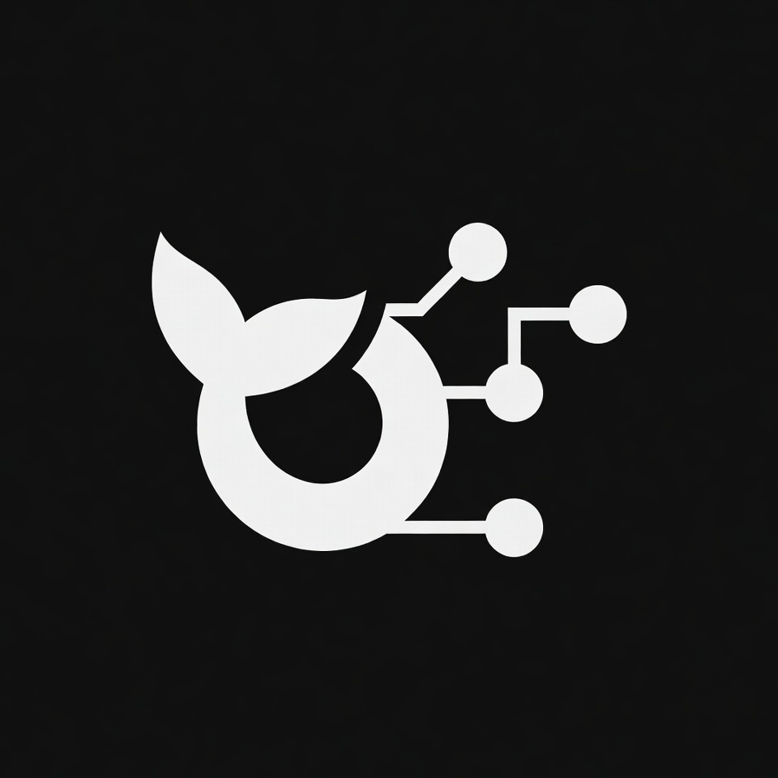
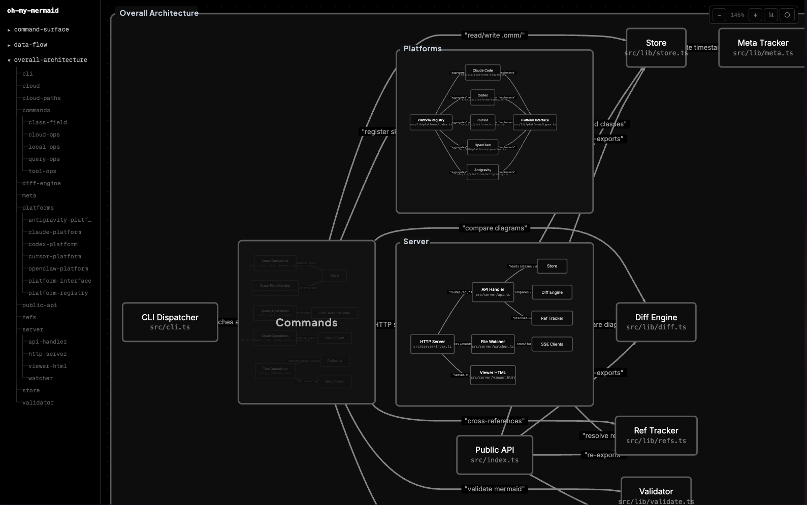
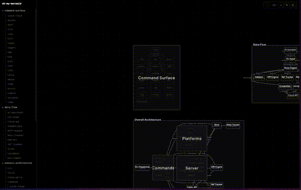

[English](./README.md) | [Türkçe](./README.tr.md) | [한국어](./README.ko.md) | [日本語](./README.ja.md) | [中文](./README.zh.md)

> 本文档翻译自英文 README。部分表述可能不够自然。

<p align="center">
  
</p>

<h1 align="center">Oh-my-mermaid</h1>

<p align="center">
  <a href="https://www.npmjs.com/package/oh-my-mermaid"></a>
  <a href="./LICENSE"></a>
</p>

<p align="center">
  AI 几秒钟就能写出代码。人类理解它需要几个小时。<br/>
  跳过理解，代码库就变成了黑盒 — 即使对你自己而言。<br/><br/>
  <strong>omm 弥合了这个差距 — 由 AI 生成的、为人类准备的架构文档。</strong>
</p>

---

## 快速开始

在终端中粘贴：

```bash
npm install -g oh-my-mermaid && omm setup
```

打开你的 AI 编码工具，使用 `/omm-scan` 技能：

```
/omm-scan
```

就这样。查看结果：

```bash
omm view
```

## 示例

> omm 扫描了自己。这是它发现的结果。

<table><tr>
<td width="50%"></td>
<td width="50%"></td>
</tr></table>

## 工作原理

AI 分析代码库并生成 **视角（perspective）** — 观察架构的不同镜头（结构、数据流、外部集成等）。每个视角包含 Mermaid 图表和文档字段。

每个节点都会被**递归分析**。复杂的节点会成为具有自己图表的嵌套子元素。简单的节点保持为叶子节点。文件系统直接反映树结构：

```
.omm/
├── overall-architecture/           ← 视角
│   ├── description.md
│   ├── diagram.mmd
│   ├── context.md
│   ├── main-process/               ← 嵌套元素
│   │   ├── description.md
│   │   ├── diagram.mmd
│   │   └── auth-service/           ← 更深层嵌套
│   │       └── ...
│   └── renderer/
│       └── ...
├── data-flow/
└── external-integrations/
```

查看器自动从文件系统检测嵌套 — 有子元素的元素渲染为可展开的组，其他渲染为节点。

每个元素最多包含 7 个字段：`description`、`diagram`、`context`、`constraint`、`concern`、`todo`、`note`。

## CLI

```bash
omm setup                          # 向 AI 工具注册技能
omm view                           # 打开交互式查看器
omm config language zh             # 设置内容语言
omm update                         # 更新到最新版本
```

完整命令列表请运行 `omm help`。

## 技能

技能是在 **AI 编码工具内部**运行的命令（不是终端）。以 `/` 开头。

| 技能 | 功能 |
| --- | --- |
| `/omm-scan` | 分析代码库 → 生成架构文档 |
| `/omm-push` | 一步完成登录 + 链接 + 推送到云端 |

## 云端

通过 [ohmymermaid.com](https://ohmymermaid.com) 将架构存储在云端。

```bash
omm login && omm link && omm push
```

默认为私有。可以与团队共享，或像[这个示例](https://ohmymermaid.com/share/c47e20a7063c231760361ed9cb9ec4b6)一样公开。

## 支持的 AI 工具

| 平台 | 设置 |
| --- | --- |
| Claude Code | `omm setup claude` |
| Codex | `omm setup codex` |
| Cursor | `omm setup cursor` |
| OpenClaw | `omm setup openclaw` |
| Antigravity | `omm setup antigravity` |

运行 `omm setup` 自动检测并配置所有已安装的工具。

## 路线图

请参阅 [docs/ROADMAP.md](./docs/ROADMAP.md)。

## 开发 & 贡献

```bash
git clone https://github.com/oh-my-mermaid/oh-my-mermaid.git
cd oh-my-mermaid
npm install && npm run build
npm test
```

欢迎提交 Issue 和 PR。请使用 [Conventional Commits](https://www.conventionalcommits.org/)。

## 许可证

[MIT](./LICENSE)
